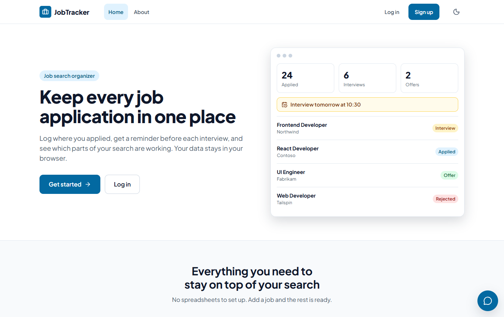
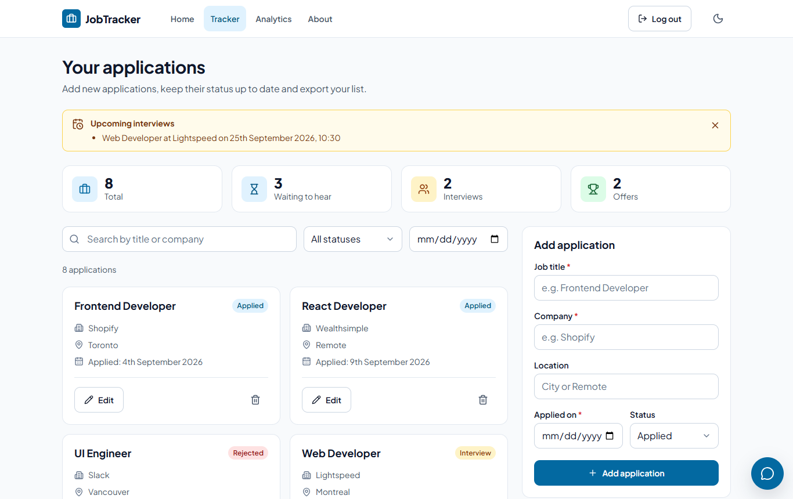
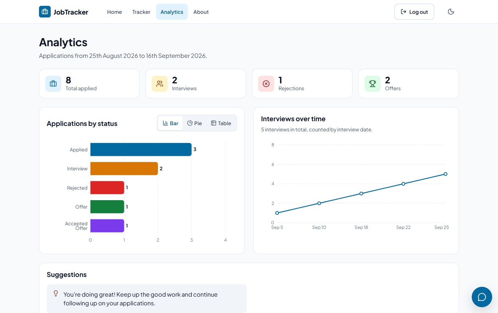
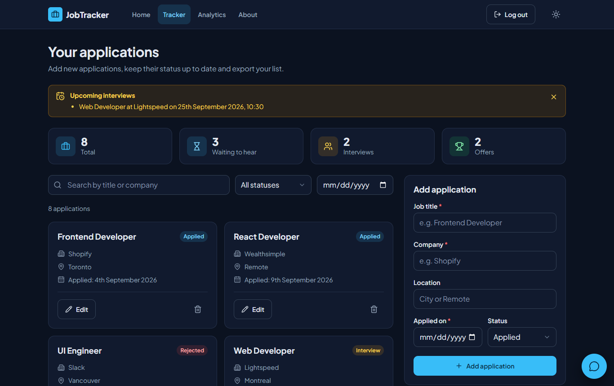
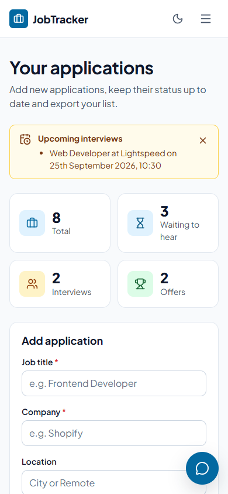

# Job Application Tracker

[](https://github.com/zainab-yekta/job-application-tracker/actions/workflows/ci.yml)

A React app for keeping track of job applications. You log each application, move it through its stages (Applied, Interview, Rejected, Offer, Accepted Offer), get a reminder before interviews, and see how your search is going on an analytics page. It runs entirely in the browser, with no server or database.

**[Live demo](https://zainab-yekta.github.io/job-application-tracker/)** · **[Source code](https://github.com/zainab-yekta/job-application-tracker)**


## Screenshots







| Dark theme                                                        | On a phone                                                                               |
| ----------------------------------------------------------------- | ---------------------------------------------------------------------------------------- |
|  |  |

## Features

**Tracking**

- Add, edit and delete applications with title, company, location, the date you applied and a status
- Interview date and time fields that appear when the status is Interview. A past interview stays on record after the job moves on to Offer or Rejected
- Search by job title or company, filter by status or by date
- Color coded status badge on each card, summary numbers at the top and a message when a list is empty
- Visible labels, an error message under each field that needs fixing, and a confirmation before deleting

**Reminders**

- Banner on the dashboard for interviews coming up today or tomorrow, based on the interview date and time
- Message when an application moves to Offer or Accepted Offer, with the option to clear the list once you've accepted a job

**Analytics**

- Applications by status as a bar chart, donut chart or table (switchable)
- Running total of interviews over time, or a simple list until there are enough interview days for a trend
- Totals and the date range of your applications
- Suggestions based on your numbers, for example a nudge to follow up when several applications are still waiting

**Export and backup**

- Download all applications as an Excel file or a PDF report, with formatted dates
- Download a JSON backup and restore it later or in another browser. Restored files are validated before anything is saved

**Accounts**

- Register and log in, with the dashboard and analytics pages only reachable when logged in
- Each account has its own list of applications
- Passwords are stored as salted PBKDF2 hashes, never as plain text
- Login stays active after a page refresh

**Other**

- Light and dark theme that follows the system setting, with a switch in the navigation bar
- Responsive layout from 375px phones to wide screens, with a collapsible menu on small screens
- Help chat behind a round button in the corner, with one tap quick questions about adding jobs, reminders, exports, backups, analytics and where data is kept. It matches keywords against a built-in list of answers (`utils/chatbotReplies.js`), so it works offline and never calls an outside service
- A recovery page instead of a blank screen if something fails, and a not found page for unknown addresses

## Tech stack

| Area     | Tools                                                    |
| -------- | -------------------------------------------------------- |
| UI       | React 19 with hooks, Lucide icons, Plus Jakarta Sans     |
| Styling  | Plain CSS with design tokens (CSS variables)             |
| Routing  | React Router 7 (HashRouter, so it works on GitHub Pages) |
| Charts   | Recharts                                                 |
| Export   | ExcelJS, jsPDF with jspdf-autotable, FileSaver           |
| Storage  | Browser localStorage behind a storage service            |
| Security | Web Crypto API (PBKDF2 with SHA-256)                     |
| Build    | Vite                                                     |
| Testing  | Vitest, React Testing Library, jsdom                     |
| Quality  | ESLint, Prettier, GitHub Actions                         |
| Hosting  | GitHub Pages                                             |

The Analytics page and the export libraries are loaded only when they're needed, so the first page load is about 290 kB of JavaScript (91 kB gzipped).

## Design

The interface is a clean, flat style suited to a productivity tool: white cards on a light slate background, a professional blue as the main color and one colored badge per status.

- **Design tokens.** Colors, type sizes, spacing, radius and motion are CSS variables in `src/styles/tokens.css`. Components never use raw colors, so the dark theme is a second set of values in the same file.
- **Contrast.** Every text and background pair meets WCAG AA (at least 4.5:1) in both themes.
- **Accessibility.** Visible labels on every field, errors under the field they belong to, visible keyboard focus, 44px touch targets, screen reader names on icon buttons, focus moved to the right place when menus and dialogs open or close, and charts that can be read as a table.
- **Motion.** Short transitions only. People who ask their system for reduced motion get no animations, charts included.
- **Shared pieces.** Buttons, fields, cards, alerts and badges live in `src/styles/base.css`; each component and page keeps its own small stylesheet next to it.

## How it works

```
 pages and components        what people see and click
          │
 hooks: useAuth, useJobs     app state (who is logged in, their jobs)
          │
 services/storage.js         the only code that reads or writes localStorage
          │
 localStorage                data in the visitor's browser
```

Pages never touch `localStorage` themselves. They get data from the `useAuth` and `useJobs` hooks, and the hooks go through `services/storage.js`. Moving the data to a real server later would mean rewriting that one file, not the pages.

Logic that doesn't need React (filters, reminders, suggestions, validation, backups, date handling) lives in plain functions under `utils/`, which keeps it easy to test.

## How data is stored

Everything is kept in the visitor's browser under keys that start with `jobTracker.`:

| Key                       | What it holds                                 |
| ------------------------- | --------------------------------------------- |
| `jobTracker.version`      | Version of the storage layout (currently `2`) |
| `jobTracker.users`        | Accounts: email, salt and password hash       |
| `jobTracker.session`      | Email of the account that is logged in        |
| `jobTracker.jobs.<email>` | That account's applications                   |
| `jobTracker.theme`        | `light` or `dark`, once the visitor picks one |

Each application looks like this:

```json
{
  "id": 1717000000000,
  "title": "Frontend Developer",
  "company": "Shopify",
  "location": "Toronto",
  "status": "Interview",
  "appliedDate": "2026-05-01",
  "interviewDate": "2026-05-10",
  "interviewTime": "14:30"
}
```

Dates are stored as `YYYY-MM-DD` and read in the visitor's time zone, so a date never shifts by a day.

The storage layout has a version number. On first load, data saved by the first version of the app (which used a single `user` and `jobs` key and a single `date` field) is moved into this layout automatically. An old plain text password is replaced with a hash the next time that person logs in.

A backup file contains the same application objects plus the app name, layout version and export time. When a file is restored, every field is checked: unknown fields are dropped, statuses, dates and times must be valid, and duplicate ids get new ones.

**Limits worth knowing:** the data exists only in the browser where it was entered, and clearing site data removes it (download a backup first). Accounts are a local demo. Hashing keeps passwords unreadable, but anyone using the same browser profile can still see or change the stored data, so this is not a replacement for real server side login.

## Run locally

You need Node.js 20.19 or newer.

```bash
git clone https://github.com/zainab-yekta/job-application-tracker.git
cd job-application-tracker
npm install
npm run dev
```

The app opens at http://localhost:3000/job-application-tracker/.

## Scripts

| Command                | What it does                                          |
| ---------------------- | ----------------------------------------------------- |
| `npm run dev`          | Starts the development server (`npm start` works too) |
| `npm run build`        | Builds the production version into `dist/`            |
| `npm run preview`      | Serves the production build locally                   |
| `npm test`             | Runs the tests once                                   |
| `npm run test:watch`   | Runs the tests and re-runs them on every change       |
| `npm run lint`         | Checks the code with ESLint                           |
| `npm run format`       | Formats the code with Prettier                        |
| `npm run format:check` | Checks formatting without changing files              |
| `npm run deploy`       | Builds and publishes to the `gh-pages` branch         |

## Tests

```bash
npm test
```

There are 96 tests. They cover the storage service and its migration from the first version, password hashing, backup validation and restore, date parsing and formatting, interview reminders, search and filters, the analytics suggestions, the help chat, the offer messages, the job form (including error messages and focus), the error page, and the main flows in the app: separate data per account, editing an application, refusing a duplicate email, staying logged in after a reload, upgrading old passwords, switching themes and the not found page.

## Continuous integration and deployment

Two GitHub Actions workflows live in `.github/workflows/`:

- **CI** runs on every push and pull request to `main`. It lints, checks formatting, runs the tests and builds the app.
- **Deploy to GitHub Pages** is started by hand from the Actions tab (Deploy to GitHub Pages, then Run workflow). It runs the checks again and publishes the site only if they pass.

For the deploy workflow to publish, the repository's Pages source must be set to **GitHub Actions** (Settings, Pages, Build and deployment).

## Project structure

```
.github/workflows/        CI and deploy workflows
docs/screenshots/         images used in this README
public/                   favicon, icons and web manifest
src/
  components/
    BackupControls.jsx    download and restore backups
    Chatbot.jsx           help chat in the corner of every page
    EmptyState.jsx        message shown when a list or chart is empty
    ErrorBoundary.jsx     recovery page when something fails
    Footer.jsx
    JobForm.jsx           add and edit form with validation
    JobList.jsx           application cards
    Navbar.jsx            top navigation, theme switch and mobile menu
    PasswordInput.jsx     password field with show and hide
    ProtectedRoute.jsx    sends logged out visitors to the login page
    StatCard.jsx          summary number with an icon
    StatusPopup.jsx       offer toast and accepted offer dialog
  constants/
    statuses.js           the list of statuses, used everywhere
  hooks/
    useAuth.js            register, log in, log out, session
    useJobs.js            the logged in account's applications
    useTheme.js           light or dark theme
    usePrefersReducedMotion.js
  pages/
    Home.jsx
    Dashboard.jsx         tracker, search, filters, reminders, export, backup
    Analytics.jsx         charts, totals and suggestions
    About.jsx
    Login.jsx
    Register.jsx
    NotFound.jsx
  services/
    storage.js            all reads and writes to localStorage
  styles/
    tokens.css            colors, type, spacing and the dark theme
    base.css              buttons, fields, cards, alerts, badges
  utils/                  dates, filters, reminders, suggestions, exports,
                          backups, validation, password hashing, migration,
                          chatbot replies
  test/setup.js           test setup
  App.jsx                 routes, per-account workspace, error boundary
  main.jsx                entry point
index.html
vite.config.js
eslint.config.js
```

Tests and stylesheets sit next to the file they belong to, for example `services/storage.test.js` and `pages/Dashboard.css`.

## License

MIT, see [LICENSE](LICENSE).

## Author

Built by **Zeinab Ramezani Yekta**
[LinkedIn](https://linkedin.com/in/zeinab-ramezani) · [GitHub](https://github.com/zainab-yekta)
